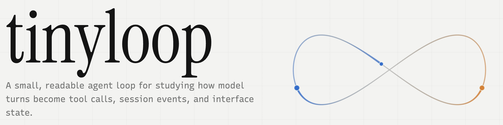

# tinyloop



tinyloop is a tiny coding agent, I originally created to learn about how to build such a system in a pragmatic manner.

It is by design minimalistic and not a production ready agent. It is meant as an educational showcase of the moving parts inside a small coding agent: a tool-using loop, a session event stream, and a terminal UI that consumes those events without knowing too much about the agent internals.

The goal for this project is to create something usable, which is a great starting point to learn about agent intrinsics.

## Quickstart

Install the CLI:

```bash
npm install --global tinyloop
```

Use your ChatGPT subscription via Codex:

```bash
tinyloop auth login chatgpt
```

Or save your OpenAI API key once:

```bash
tinyloop auth login
```

Start tinyloop in a workspace:

```bash
tinyloop
```

Run demo mode without an API key:

```bash
tinyloop --demo
```

You can also use an environment variable for temporary sessions or CI:

```bash
OPENAI_API_KEY=sk-... tinyloop
```

## Local development

Install dependencies:

```bash
pnpm install
```

Run the local TUI in demo mode:

```bash
pnpm demo
```

Build the local CLI:

```bash
pnpm build
```

Install the local CLI globally for dogfooding:

```bash
pnpm add --global ./packages/cli
tinyloop
```

If `tinyloop` is not found after global install, run:

```bash
pnpm setup
```

Then restart your terminal.

## Packages

- `packages/agent` publishes as `tinyloop-agent`. It contains the agent loop and tools. It exposes the public session contract through `AgentEvent`, `AgentCommand`, and `AgentSession`.
- `packages/tui` publishes as `tinyloop-tui`. It contains the Ink terminal UI, the `SessionDriver` contract, reducers, and transcript components.
- `packages/cli` publishes as `tinyloop`. It resolves local auth, creates the agent-backed session driver, and renders the TUI.

## Architecture

The important boundary is:

```text
AgentSession -> SessionDriver -> reducer -> Ink components
```

The TUI does not call tools directly and does not know about OpenAI. It consumes normalized session events:

- turn lifecycle events
- user and assistant messages
- tool start/progress/finish events
- failure events

That makes the UI easy to test with a fake or demo session driver.

## Checks

```bash
pnpm check
pnpm test
```

## Future
- `web GUI`: a local backend and browser UI, which would introduce persistence and richer session management.
- `more commands`: interrupts, approvals, message queuing, cancellation, and steering.
- `session persistence`: save and resume transcripts.
